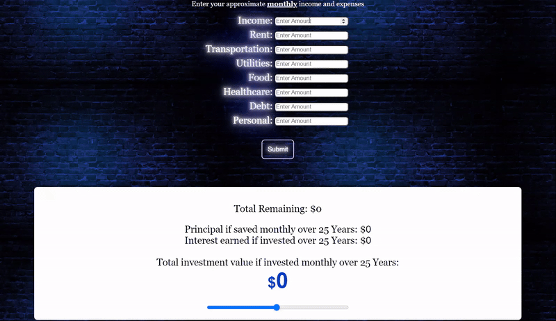

# Fully Finance
Fully Finance is a finance tool website designed to help you manage your finances more effectively by providing insights into potential investment returns based on your monthly income and expenses.

### 
Try it out: [<u>Fully Finance</u>](https://MariiaNikitash.github.io/Fully-Finance/)

## Purpose:
This tool visualizes the exponential effect of compound interest and how saving and investing just a couple dollars a month here and there will compound into thousands down the line.

Through this tool, we hope to encourage users to minimize wasteful consumption of food, energy, and more by showing users how modest saving can make a big impact.

## How it works
Users enter their monthly income followed by monthly expenses in 7 different categories. The JavaScript recieves these inputs and calculates various savings and investment returns.

**Principal:** \
This is the value of savings if the remainder was saved each month over the specified number of years.

**Interest:** \
This is the amount of compound interest that would accrue if the remainder was invested monthly with an average annual return of 10% (not counting principal).

**Compound Interest:** \
This is the total investment value if the remainder was invested monthly over the specified number of years with a 10% average annual return.

## The Formula
$$ FutureValue= \frac{R*((1  +  \frac{i}{c})^{n*c}-1)}  {\frac{i}{c}} $$

$R$ = Monthly contribution x 12 (Yearly contribution) \
$i$ = Annual interest rate (10% &rarr; 0.1) \
$c$ = Compounding frequency (1 for annual) \
$n$ = Number of years \
This formula assumes an initial principle of $0.

## 10% Average Annual Return?
The S&P 500 is a stock market index that tracks the performance of the 500 largest publicly traded companies in the United States. It's considered a benchmark for the overall U.S. stock market.

According to [<u>this article on investopedia.com,</u>](https://www.investopedia.com/ask/answers/042415/what-average-annual-return-sp-500.asp) "The average annualized return since [...] 1957 through Dec. 31, 2023, is 10.26%" (Maverick 1).

The stock market experiences ups and downs. Some years the S&P 500 might go up significantly, while others it might go down. The 10% average reflects this volatility, with good years balancing out lower ones.

## Contibutors

**Front-end** &emsp; &emsp; &emsp; &emsp; &emsp; &emsp; &emsp; &emsp; &emsp; **Back-end**

 &emsp; &emsp; &emsp;

